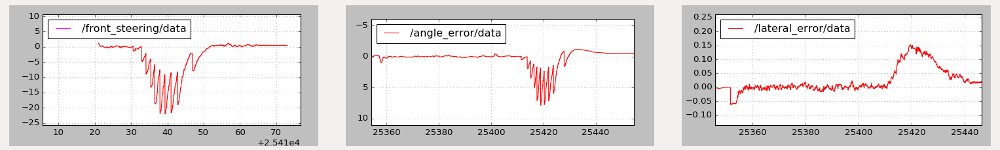
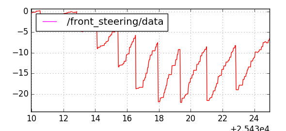
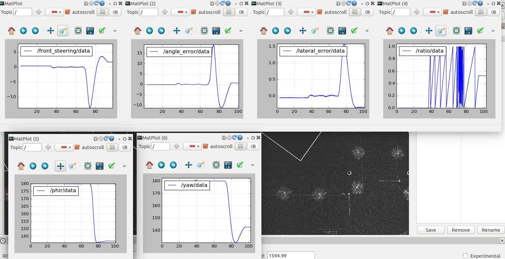
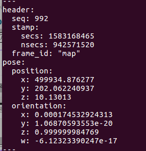
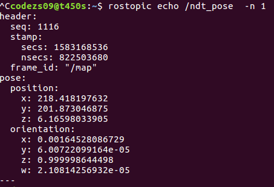

## Update For the Path Following ROS Module

### Revision to waypoints and `waypoint_updater()`

[//]: # "Image References"
[fig1_xy]: ./pic/f1_xy_smth.png	"smoothed waypoints"
[fig1_ang]: ./pic/f1_th_smth.png	"angle values after smoothing"
[fig1_wpmarker]: ./pic/f1_wpupdate.png "updated waypoint markers"
[fig1_str]: ./pic/f1_str.png	"front steering v1"
[fig1_angerr]: ./pic/f1_angerr.png "angle error v1"
[fig1_angerr_zoom]: ./pic/f1_angerr_zoom.png "zoom of angle error v1"
[fig1_laterr]: ./pic/f1_laterr.png "lateral error v1"

The raw waypoints data are very rugged. Therefore, we preprocess the data offline before publish it throught the `waypoint_loader()`. The process steps include: 

* Evenly distribute the waypoints with a gap, say `1 m`. Calculate and smooth the curvature values along these discrete waypoints. 
* Re-generate waypoints along the path with their density proportional to the curvature radius values. 
* Adjust these waypoints' positions by solving the optimization equation similar to [the report for Stanley](https://onlinelibrary.wiley.com/doi/abs/10.1002/rob.20147). 

The processed results are as shown below. It could be observed that the waypoints have been adjusted such that the heading angle changes more smoothly. 

| Processed waypoints  | Heading from waypoints |
| :------------------: | :--------------------: |
| ![alt text][fig1_xy] | ![alt text][fig1_ang]  |

The `waypoint_updater()` ros package has also been changed to update 5 markers (in blue in the plot below) at a time, with the current position within the first segment. 

![alt text][fig1_wpmarker]

The `pathfollow` rosnode was run altogether with localization packages from *Autoware* AD stack. The steering, tracking error data were collected with *rqt_plot* as shown below. 

| Front steering [rad]  |    Angle error [rad]     |    Lateral error [m]     |
| :-------------------: | :----------------------: | :----------------------: |
| ![alt text][fig1_str] | ![alt text][fig1_angerr] | ![alg text][fig1_laterr] |

The steering has been greatly improved from previous run with the raw waypoints. This shows how important the layout of waypoints is for the low-level tracking control. Apparently there are still some improvements need to be made in the following aspects: 

* The controller feedback gain and other parameters need to be adjusted. Right now it seems the gain is not large enough, showing a soft turn at the corner. 

* The reading of Angle error is not pleasant. Convert it within the range of [-*&#960;*, *&#960;*]. 

* For convenience of visualization, show in the plots the angle values in degree rather than radian. 

* The steering at the corner still shows a lot of zigzags or oscillations. This directly relates to the same pattern in the calculated angle error, as depicted in the zoom of the angle error plot below:

  ![alt text][fig1_angerr_zoom]

---

### Steering Control Improvement 

Followed the suggestions above, we adjust feedback gain, change unit etc, except the last "zigzag" comment. The results are shown below. With a larger feedback gain, the lateral error is smaller but the steering oscillation is too large. 

 

A zoom-in of the steering shows exactly the same pattern as the calculated heading error. Hence we need to improve the way on how we obtain the reference heading from the waypoints. Interpolation? Take use of station? 

The reference heading has to be calculated in a way that smooth transition should be ensured as the vehicle drives. 

After modification to the code, the reference heading now changes continuously as the vehicle moves forward. The path tracking works well at low speed and low feedback gain (as the plot shown below). But probably due to the lag of the vehicle heading from ndt matching, the vehicle easily loses stability when the speed or the gain increase. 

A further look at the sensor configuration shows that the Lidar in LGSVL outputs messages every 100 ms. This is followed by communication delay, and ndt matching for localization. This could be the cause of the tracking instability as the speed increases. What if we use GPS sensor for localization (increase its frequency from default 12.5 Hz to 100 Hz )?  The plot below shows the comparison of vehcicle pose information obtained from GPS vs. NDT. The right pose information is correct and matches the simulator data in LSGVL. The error of GPS reading may due to wrong transformation due to the different coordinate system used in LGSVL and ROS. 

| topic /gnss_pose           | topic /ndt_pose            |
| -------------------------- | -------------------------- |
|  |  |

First we changed a line in LGSVL source code to remove the x offset ( following

[github issue reported]: https://github.com/lgsvl/simulator/issues/641	" GPS outputs data with offset"

and rebuild the simulator in Unity). A finding is that once we made this change, the `/odom` topic which broadcasts the gps odometry information also changes (now its position is not correct with the offset, but anyway its orientation info is w.r.t. the left-hand coordinate system used in LGSVL and not the regular one used in ROS). We will use its twist information for linear and angular speed only (its twist data matches the coordinate system in ROS). 

After we use GPS location broadcast at 100 Hz for localization, the vehicle is capable to maintain its stability with a increased speed. However, as the speed increases, the vehicle still tend to lose stability, which may be casused by the communication delay between sensor input and steering command output to the simulator. Any other possibilities? queue size or rate of subscribers and publishers? gps plane?

